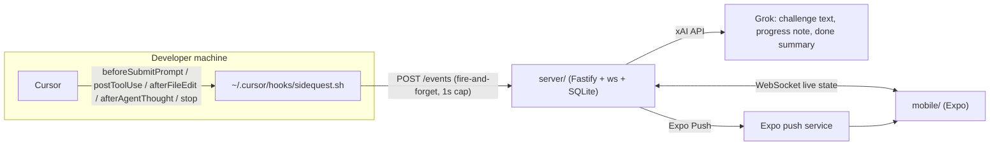

# Sidequest

**Mobile companion for Cursor agent wait time.** Grok + Cursor Hackathon, 2026-09-25.

You send a prompt in Cursor. Your phone buzzes within a second with a challenge sized to the predicted run length: 20 squats, a one-question Grok quiz about what the agent is building, or a 60-second tap-reflex game. The moment the agent finishes, the phone buzzes again with a one-line summary of what changed, so you walk back ready to review. Nothing is guessed: Cursor hooks give exact start and stop signals.



## Layout

| Path | What |
| --- | --- |
| `hooks/` | Cursor user hook (`hooks.json` + `sidequest.sh`) and `install.sh` |
| `server/` | Relay: run state machine, duration predictor, Grok content, pairing, push |
| `mobile/` | Expo app: pairing, live run screen, challenges, stats |
| `shared/events.ts` | Types shared by all three |

## Quick start

Requirements: Node 22.9+ (`node -v`; the relay's `npm start` uses `--env-file-if-exists`), `curl` and `jq` on the machine running Cursor (`sudo apt install jq` / `brew install jq`), and a phone with [Expo Go](https://expo.dev/go) from the Play Store / App Store on the **same Wi-Fi** as the computer. No Expo account is needed. Everything the app uses (camera, haptics, local notifications, AsyncStorage) is bundled in Expo Go, so no dev build or APK is required.

### 1. Relay

```bash
cd server
npm install
cp .env.example .env      # add XAI_API_KEY for Grok content (optional)
npm start
```

The relay always listens on port 80. It prints a QR code, its LAN URL (e.g. `http://10.0.0.215`) and a 6-digit pairing code. `GET /pair-qr` serves the same QR as a web page. Set `PAIR_CODE=123456` in `.env` to keep the code stable across restarts. Binding to port 80 needs root, or `setcap cap_net_bind_service=+ep` on the node binary.

The URL is the first non-loopback IPv4 of the machine. If it is not the address your phone can reach (VPN, Docker/VM, several adapters), set `PUBLIC_URL=http://<your-ip>` in `.env`; find the IP with `ip -4 addr` / `ipconfig`. Check from the phone's browser: `http://<ip>/health` must return `{"ok":true,...}` before pairing.

### 2. Cursor hook

```bash
./hooks/install.sh                        # relay on this machine
./hooks/install.sh http://10.0.0.215   # relay elsewhere, always port 80
```

This copies `sidequest.sh` to `~/.cursor/hooks/`, writes `~/.cursor/sidequest.env` with the relay URL, and merges the five Sidequest entries into `~/.cursor/hooks.json` (existing hooks are preserved). Cursor reloads `hooks.json` on save; check the **Hooks** output channel if events do not show up.

The hook is fail-open: it backgrounds a `curl` with a 1-second cap and always exits 0, so a stopped relay never slows or blocks the agent.

### 3. Phone

```bash
cd mobile
npm install
npx expo start
```

Metro prints its own QR. On Android open **Expo Go** and use its **Scan QR code** button; on iOS use the Camera app. The Sidequest pair screen appears after the bundle loads. Tap **Scan QR code**, allow the camera, and point it at the *relay's* QR (the one from `npm start` in `server/`), or type the address and code. Pick a challenge mode on the home screen:

- **Move**: exercise from a fixed list, reps scaled to about two thirds of the predicted wait. Grok only writes the one-liner.
- **Quiz**: one Grok multiple-choice question derived from the prompt and project; the answer and explanation are revealed when the agent stops.
- **Game**: tap-reflex, freezes the instant the agent finishes.
- **Mixed**: rotates.

### 4. Demo without Cursor

```bash
cd server
npm run simulate -- 25    # replays a 25-second fake agent run
```

## How the wait is predicted

The relay stores each completed run per project and predicts the next one as the rolling median of the last 10 durations, clamped to 30s..15min, defaulting to 90s for a new project. The phone shows elapsed vs predicted; the bar turns amber past 100% instead of pretending.

## Demo script

1. Show the relay terminal with the QR; pair the phone.
2. In Cursor, send a real prompt. The phone buzzes and shows the challenge within ~1.5s.
3. While the agent works: progress bar creeps, "Refactoring the auth middleware and adding tests" note appears from Grok, file count ticks.
4. Agent finishes: haptic, "Agent done in 87s", one-line summary, quiz answer revealed / game frozen with score. Tap **Back to the diff**.
5. Send a second prompt: the prediction is now based on the first run.

## Notes and limits

- Remote push (banner while the app is closed) uses Expo's push service and needs a real device. In Expo Go on Android remote push is unsupported since SDK 53; the app still gets everything over the WebSocket and fires local notifications when backgrounded.
- Only one run is tracked at a time; a follow-up prompt during a run extends the same wait.
- Grok is optional. Without `XAI_API_KEY` the relay uses canned exercises, quizzes and summaries.
- Deploy the relay anywhere (Fly.io, Railway) and set `PUBLIC_URL` so the QR points at the public address.

## Development

```bash
cd server && npm test && npm run typecheck
cd mobile && npx tsc --noEmit && npx expo-doctor
```
